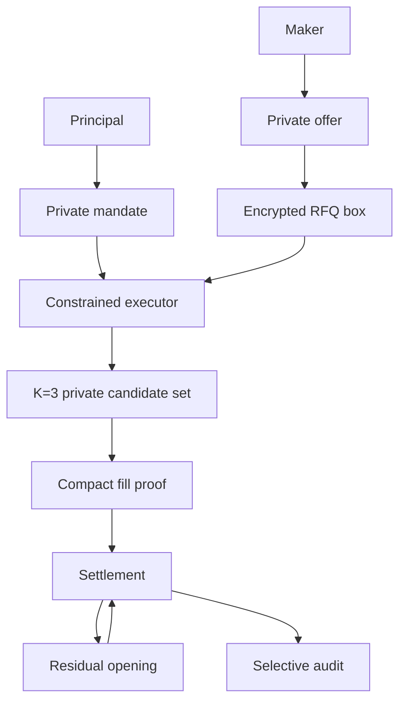
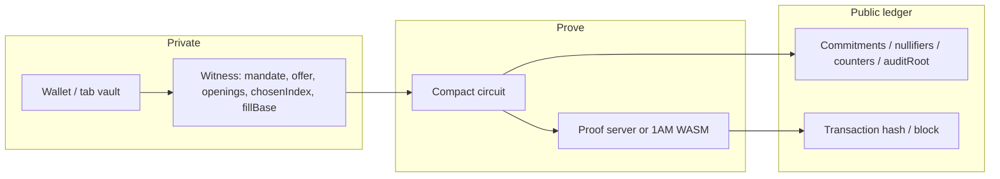
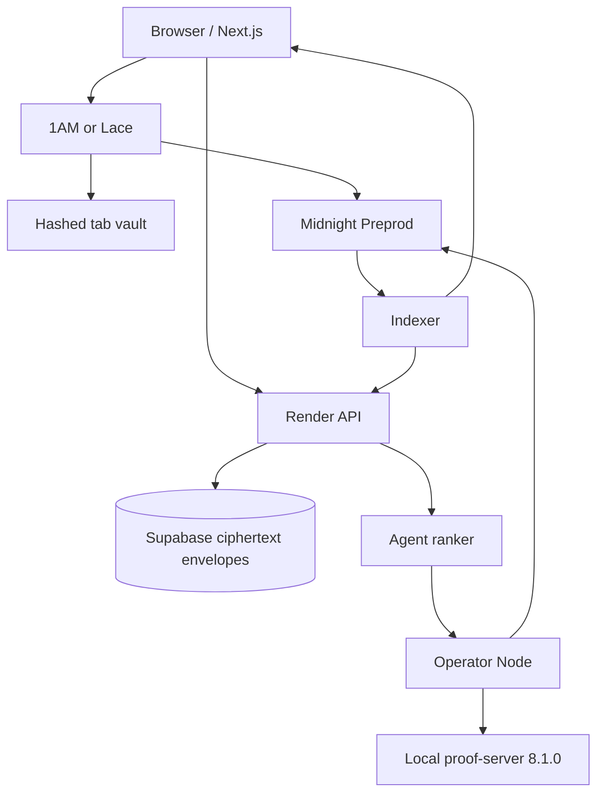
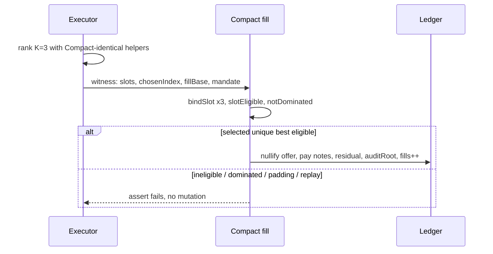
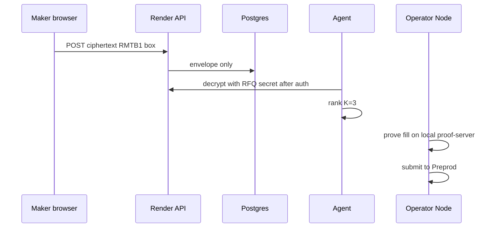
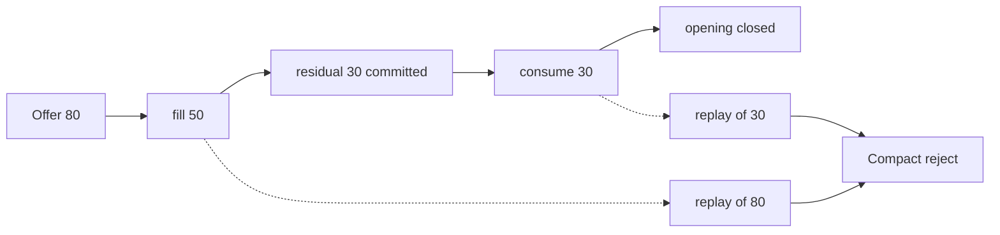
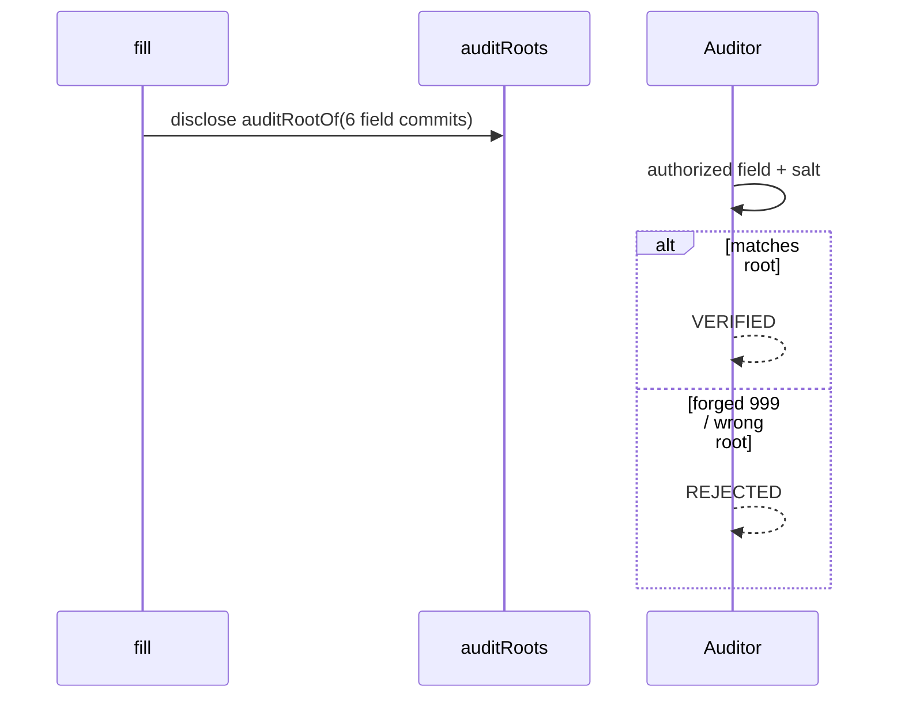
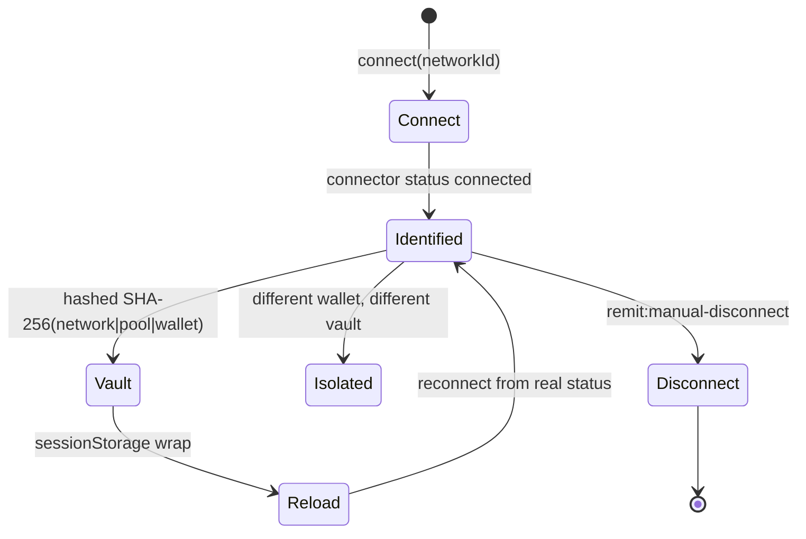
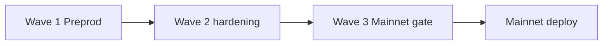

# REMIT

Private execution where an agent can choose, but cannot exceed the mandate.

```
PRIVATE MANDATE
+
PRIVATE LIQUIDITY
+
CONSTRAINED EXECUTOR
+
ZK POLICY ENFORCEMENT
=
VERIFIABLE EXECUTION
```

REMIT is a mandate-bound dark RFQ desk on Midnight. A principal seals trading rules the public ledger never contains. Counterparties quote privately. A constrained executor may choose among the private candidates it is given. Compact proves the fill obeyed the mandate before value moves. Selective audit can later open one authorized fact without opening the book.

Wave 1 is live on Midnight Preprod (`protocolVersion` 1000000, ledger 8). Wave 2 hardens the same protocol. Wave 3 targets Mainnet after an explicit capability gate.

Pinned stack (do not bump for this pool): Compact **0.31.1** / language **0.23** / midnight-js **4.1.1** / wallet-sdk **1.2.0** / DApp Connector **4.0.1** / proof-server **8.1.0** / indexer **4.3.3-hotfix**.

Hosted UI: https://remit-front.vercel.app  
Hosted API: https://remit-api-node.onrender.com  
Source: this repository. License: Apache-2.0.

---

## Why REMIT exists

Delegated execution leaks strategy. A limit price, a size, a remaining budget, an expiry, and an admitted counterparty set are signals. Anyone who can read them can trade against them. Asking an agent or a desk to "be careful" is not a proof.

REMIT makes the policy itself the object of cryptography:

- The **principal** authorizes an executor inside a private mandate.
- **Makers** quote private offers into an encrypted RFQ path.
- The **executor** may rank and select. Compact will not settle a fill that violates the mandate.
- The **public ledger** records commitments, nullifiers, counters, and an `auditRoot`. It does not store openings, prices, `chosenIndex`, or `fillBase`.

The agent is constrained execution infrastructure, not a chatbot and not settlement authority. Model output never authorizes a fill.

---

## Core idea



1. Principal seals a **Mandate** (asset, side, cap, limit, remaining, `cpRoot`, executor key, expiry).
2. Maker seals an **Offer** (side, size, price as base/quote, minFill, expiry) and optionally boxes it as RMTB1.
3. Executor receives openings it is given, ranks a **K=3** private book, and proves `fill(nowBound)`.
4. Compact consumes the selected offer, pays both sides as notes, inserts a residual offer if leftover size remains, writes `auditRoot`, increments `fills`.
5. Principal may **revoke**. Owner may **withdraw** leftover notes. Auditor may verify one authorized field against `auditRoot`.

---

## What Midnight protects

Midnight is a dual-ledger system. Compact circuits run locally over private witnesses and disclose a minimum public transcript plus a ZK proof.



Official Midnight guidance: the proof server sees witnesses in the clear. REMIT therefore proves user circuits in the wallet (1AM `getProvingProvider`) or on an operator-controlled local proof-server 8.1.0. Render does not receive fill witnesses.

---

## System architecture



Where plaintext exists:

| Location | Plaintext | Encrypted / committed |
|---|---|---|
| Browser tab vault | Mandate/offer openings after unlock | AES wrap; storage key is `SHA-256(network\|pool\|wallet)` |
| 1AM in-tab prove | Witness during prove | Proof only on the wire to Midnight |
| Operator Node + local proof-server | Fill witness during prove | Not on Render |
| Render API | Public hashes, ciphertext boxes | RMTB1 envelopes; no openings in JSON |
| Postgres | Ciphertext, owner binding | RLS deny-all; no service role in the browser |
| Ledger | Amounts at unshielded deposit/withdraw; commitments, nullifiers, counters | Openings never stored |

---

## Private vs public state

| Object | Private | Public | Boundary |
|---|---|---|---|
| Mandate | terms, `mandateData`, rand | `mandateCommitment`, revocation tag | openings never in JSON |
| Offer | price, size, maker, minFill | `offerCommitment`, offer nullifier | RFQ box is ciphertext |
| Fill | `chosenIndex`, `fillBase`, `fillQuote`, K-set | `fills++`, residual commit, `auditRoot` | Compact asserts; agent cannot override |
| Residual | leftover opening | new offer commitment | spent opening cannot replay |
| Audit | field openings | `auditRoot` | one-field verify; forged fails |
| Custody | note nonce, owner secret | unshielded amount at deposit/withdraw | amount is the unshielded boundary |
| Wallet | Bech32 address, wrap key | none in storage keys | hashed namespace |

---

## Protocol objects

- **Note** — private unshielded-backed pool note (`asset`, `amount`, `owner`).
- **Offer** — private quote (`side`, `baseAmount`, `quoteAmount`, `maker`, `payNonce`, `expiry`, `minFillBase`).
- **Mandate** — private policy (`principal`, `executor`, `side`, `maxFillBase`, limit, `cpRoot`, `expiry`, `mandateId`).
- **MandateState** — `{ mandateId, remaining }` committed separately so remaining can change without republishing the mandate.
- **Residual** — leftover offer after a partial fill (`baseAmount - fillBase`, derived `payNonce` / rand).
- **Nullifier** — spend tag for notes, offers, and mandate states.
- **AuditRoot** — `auditRootOf` over six field commitments (side, fillBase, fillQuote, principal, maker, mandateId).
- **Disclosure package** — one authorized field + salt + `auditRoot`; forged values fail `verifyDisclosure`.

---

## Compact contracts

`CONTRACT/src/remit_pool.compact` — pragma `>= 0.22 && <= 0.23`, toolchain **0.31.1**. Seven impure circuits. Do not add an eighth.

`CONTRACT/src/remit_quote.compact` — REMIT-Q faucet. Separate contract. No cross-contract calls.

### Pool circuits

| Circuit | Purpose | Private | Disclosed / public effect | Fails when |
|---|---|---|---|---|
| `deposit` | Mint a note from unshielded funds | owner secret, nonce | asset, amount (unshielded receive) | bad asset, zero amount |
| `withdraw` | Return note value to `withdrawTo()` | owner secret, note | asset, amount, recipient | wrong owner, insufficient note |
| `placeOffer` | Commit an offer, escrow size | `offerData`, rand, note | offer commitment, `openOffers++` | not maker, bad size, escrow too small |
| `cancelOffer` | Nullify unused offer, return escrow | offer, path | offer nullifier, `openOffers--` | not owner, already used |
| `createMandate` | Commit policy + remaining | `mandateData`, rand, note | mandate + state commitments, `activeMandates++` | not principal, empty escrow |
| `revokeMandate` | Kill mandate, return remaining | mandate + state openings | revocation tag, state nullifier, `activeMandates--` | not principal, already revoked |
| `fill` | Prove policy, settle, residual, audit | executor secret, mandate, K=3 book, `chosenIndex`, `fillBase` | offer nullifier, residual commit, notes, `auditRoot`, `fills++` | ineligible, dominated, replay, cap, price, budget, expiry, wrong executor |

### Quote circuits

| Circuit | Purpose |
|---|---|
| `quoteColor` | `tokenType("remit:quote", self)` |
| `claim` | Mint up to 1000 REMIT-Q per (caller, UTC-day). Not a stablecoin. |

---

## MBBE (K=3)

MBBE proves the best eligible candidate among the **K=3 private openings** supplied in the executor's witness (`book()`). This bounded witness-set semantics is deliberate.



Eligibility (simplified): live slot, opposite side, not expired, price inside limit, size inside cap and remaining, counterparty under `cpRoot` (or open), `minFill` respected unless filling the whole offer.

Padding: `live=false` cannot win. All-ineligible fails. A strictly worse eligible slot fails `notDominated`. The executor cannot prefer a dominated candidate without a failed proof.

Wave 2 investigates encoding still more of the ranking predicate in-circuit. Wave 2 does not claim a global order book.

---

## RFQ



Public HTTP never lists openings. Admin `/inbox` is Bearer. Replay nonces reject duplicate boxes.

---

## Residual lifecycle



Verified on Preprod: fill 50/80 `5a1200f5…` block 2549944, residual 30 `5f1203cf…` block 2550168.

---

## Selective audit



Live head: `1bbc1cc2aa2cd83de56cb8ea15ec5dfb8dd071cf2fb305980416ed726b81a694`. Chrome auditor: fill amount 30 VERIFIED; forged 999 REJECTED.

---

## Wallet lifecycle



Header DUST is a fee meter, not spendable coins. Lace requires local proof-server 8.1.0 at `http://localhost:6300`.

---

## Proof architecture

Compile (WSL): `compact compile` 0.31.1 → ZKIR + verifier keys (committed) + prover keys (gitignored, hosted at `/keys`).

- Browser path: 1AM `getProvingProvider` for createMandate, revokeMandate, placeOffer, deposit, withdraw.
- Executor path: operator Node + Docker `midnightntwrk/proof-server:8.1.0`.
- Hosted Render does not run a proof-server. That is the privacy boundary, not a missing feature.

---

## Verified Wave 1 capabilities

| Capability | What is proven | Evidence |
|---|---|---|
| 7 Compact circuits | Compile + managed artifacts, compiler 0.31.1 | `inspect-managed` |
| Private mandate | In-wallet create and revoke | [`5172ab71…`](https://explorer.1am.xyz/tx/5172ab712e2cb39e5f455dd8cec609765d6fe2225ca0b0e97412cfc436df8fa9?network=preprod) / [`8ae27d7a…`](https://explorer.1am.xyz/tx/8ae27d7a3930c284a410198234d97ad110f0668af29cf89c42091b3b51882f49?network=preprod) |
| Private liquidity | Maker offer + encrypted RFQ | [`c303ec61…`](https://explorer.1am.xyz/tx/c303ec61c09d406acfbec24915dd83c0546c1e833329a3e6a2f7de53b15265b2?network=preprod) |
| Constrained executor | K=3 policy execution | [`12306cbe…`](https://explorer.1am.xyz/tx/12306cbe24823f1ac39f0a1db3ee23214cc84d44cb8014b1d2f84d67838cbd20?network=preprod) |
| ZK policy enforcement | Compact accepts/rejects adversarial cases | `TESTS/security`, `TESTS/privacy` |
| Partial execution | 50/80 fill | [`5a1200f5…`](https://explorer.1am.xyz/tx/5a1200f5869cb60c81f9ebcb649da45fb47c563bc245c362d36665597b16f00a?network=preprod) |
| Residual lifecycle | leftover 30 consumed | [`5f1203cf…`](https://explorer.1am.xyz/tx/5f1203cf9cdde32192f4a2cdce275ff34529b19bbe24644f6014b1c24f12b99f?network=preprod) |
| Replay resistance | consumed openings rejected | Compact sim + operator |
| Selective audit | one-field verification | `auditRoot` `1bbc1cc2…` |
| Tamper rejection | forged disclosure rejected | `/audit/verify` `ok:false` |
| Real custody | deposit and withdraw | [`cdb04c15…`](https://explorer.1am.xyz/tx/cdb04c15462fad79bcd851ec39604bae32ef3b8f2463eb44aea7e7365c05ff2d?network=preprod) / [`999e2b5b…`](https://explorer.1am.xyz/tx/999e2b5b3a32c7537ebba3ecb9afd7bce77f8ff205f97e361c2be5e35490fce5?network=preprod) |
| Wallet reconnect | reload + connector status + hashed vault | Chrome + `TESTS/unit/wallet-reconnect.test.ts` |
| User isolation | wallet-scoped state | `TESTS/security/isolation.test.ts` |
| Persistent backend | ciphertext envelopes survive restart | Supabase `persist.backend=supabase` |
| Chrome end-to-end | real wallet + real Preprod mutations | createMandate, revokeMandate, deposit |
| CI | compile, test, security, docs gates | `.github/workflows/ci.yml` |

---

## Preprod evidence

Network: Preprod. Pool: `01bebd52ad1b243b390c853bbc2c1588d1cf0f487934d54d79f8a590505c105e`. Quote: `7559e38693725dafef73486f2ee3aa30ee0b5b543e22d0aa5ad7303c37b55e3f`.

Explorer: `https://explorer.1am.xyz/tx/<hash>?network=preprod` (also `https://preprod.midnightexplorer.com/tx/<hash>`).

| Action | Tx | Block | What it proves |
|---|---|---|---|
| Quote deploy | [`04800c4c…08008`](https://explorer.1am.xyz/tx/04800c4ca43dd572d77ca1e5cf604702c609ff091ecb567f942ff15e17c08008?network=preprod) | 2538374 | REMIT-Q instance |
| Pool deploy | [`55224e41…61798a`](https://explorer.1am.xyz/tx/55224e41e1b68f5cc65286f19e7269b199563158806fc5ae03fe9f536c61798a?network=preprod) | 2541620 | MBBE K=3 pool |
| Padded K=3 fill | [`8fac31ab…b92e55`](https://explorer.1am.xyz/tx/8fac31ab4a7b76e91f8da95d8bfd0099f0a754daa4641d571dcdd45b59b92e55?network=preprod) | 2541757 | padding cannot win |
| 3-maker partial | [`12306cbe…38cbd20`](https://explorer.1am.xyz/tx/12306cbe24823f1ac39f0a1db3ee23214cc84d44cb8014b1d2f84d67838cbd20?network=preprod) | 2542039 | live K=3 + residual commit |
| Mandate | [`308c7b2c…010749`](https://explorer.1am.xyz/tx/308c7b2c57a8ab9aeefea4a1c243f5da056e6b5f4dbd4dc234cdb84aa1010749?network=preprod) | 2541972 | lifecycle createMandate |
| Maker offer | [`c303ec61…5265b2`](https://explorer.1am.xyz/tx/c303ec61c09d406acfbec24915dd83c0546c1e833329a3e6a2f7de53b15265b2?network=preprod) | 2548791 | 0 public outputs |
| RFQ fill 50/80 | [`5a1200f5…16f00a`](https://explorer.1am.xyz/tx/5a1200f5869cb60c81f9ebcb649da45fb47c563bc245c362d36665597b16f00a?network=preprod) | 2549944 | hosted RFQ consume |
| Residual 30 | [`5f1203cf…12b99f`](https://explorer.1am.xyz/tx/5f1203cf9cdde32192f4a2cdce275ff34529b19bbe24644f6014b1c24f12b99f?network=preprod) | 2550168 | leftover consumed |
| Withdraw | [`999e2b5b…490fce5`](https://explorer.1am.xyz/tx/999e2b5b3a32c7537ebba3ecb9afd7bce77f8ff205f97e361c2be5e35490fce5?network=preprod) | 2550510 | Compact `withdraw` SucceedEntirely |
| Chrome createMandate | [`5172ab71…36df8fa9`](https://explorer.1am.xyz/tx/5172ab712e2cb39e5f455dd8cec609765d6fe2225ca0b0e97412cfc436df8fa9?network=preprod) | 2551299 | 1AM, 0 public outputs |
| Chrome revoke | [`8ae27d7a…1882f49`](https://explorer.1am.xyz/tx/8ae27d7a3930c284a410198234d97ad110f0668af29cf89c42091b3b51882f49?network=preprod) | 2551669 | indexer `activeMandates` 4 to 3 |
| Chrome deposit | [`cdb04c15…05ff2d`](https://explorer.1am.xyz/tx/cdb04c15462fad79bcd851ec39604bae32ef3b8f2463eb44aea7e7365c05ff2d?network=preprod) | 2551700 | in-tab `deposit` |

v1 pool `e82dea02…` is historical single-offer evidence. It is not the K=3 pool.

Committed copy: `apps/api/preprod-evidence.json`.

---

## Architectural boundaries

These are properties of the current architecture, not failed gates.

1. **MBBE is K=3.** Compact proves uniqueness among the three private slots in that witness, not over the global book. Wave 2 strengthens the in-circuit relation inside K.
2. **Executor proving is operator-local.** Private fill witnesses are not delegated to a third-party hosted prover. User circuits prove in the wallet (1AM) or on Lace's local proof-server.
3. **Unshielded custody discloses amount** at deposit and withdraw. Interior note accounting is committed.
4. **REMIT-Q is testnet-only.** Not a stablecoin. Mainnet quote asset is a Wave 3 gate item.
5. **Mainnet is Wave 3.** Compact 0.34 / ledger 9 is a different generation. This pool stays 0.31.1 / ledger 8 until the gate is experimentally green.
6. **Metadata and timing** are not magically eliminated. Ciphertext size, timestamps, and public counters remain. Wave 2 adds unlinkable discovery.
7. **Witness truthfulness is not provenance.** Compact proves the relation on the openings it is given. It does not prove the executor was handed every offer in the world.

A leftover note is spendable only from the namespaced vault that holds its opening. That is how Compact notes work.

---

## Tests

Latest verified full run: **46 files / 189 passed** (`vitest run`; Playwright hosted spec is separate and not the default suite).

Layout:

- `TESTS/unit` — Compact sim, API, wallet, durable persist, MBBE rank, circuit bundle
- `TESTS/security` — unauthorized revoke/cancel/withdraw, policy, isolation, MBBE adversarial
- `TESTS/privacy` — public dump leaks, correlation tags, API/log leak, audit verify, hosted evidence
- `TESTS/integration` — compact-runtime lifecycle
- `TESTS/e2e` — hosted honesty (read-only)

Adversarial coverage that actually exists in those files: over-cap, bad price, remaining budget, expiry, revoke, wrong executor, wrong counterparty, opposite side, replay, invalid padding, all-ineligible, dominated candidate, residual vs stale opening, forged disclosure, wrong audit binding, cross-principal isolation, plaintext leakage, public API leakage.

```bash
npm test
npm run test:unit
npm run test:security
npm run test:privacy
npm run test:integration
npm run secret-scan
```

---

## Judge quick start

### Path A - read-only, no wallet

1. Open https://remit-front.vercel.app (Overview reads indexer-backed `/evidence`).
2. GET https://remit-api-node.onrender.com/health - `network=preprod`, `mpc=false`, persist supabase.
3. GET https://remit-api-node.onrender.com/evidence - public hashes only.
4. GET https://remit-api-node.onrender.com/chain - `fills`, `activeMandates`, `protocolVersion=1000000`.
5. Click any hash in the table above.

### Path B - local reproduction

```bash
npm install
npm run compile:skip-zk
npm test
npm run judge:proof
```

Full zk compile (WSL Ubuntu on Windows):

```bash
compact compile --version   # 0.31.1
npm run compile
npm run proof:up            # docker midnightntwrk/proof-server:8.1.0 :6300
```

### Path C - live Preprod + Chrome

1. 1AM wallet, Midnight Preprod.
2. https://remit-front.vercel.app - Connect, Open workspace.
3. Seal a mandate. Indexer `activeMandates` must increase. Explorer `createMandate` SUCCESS, 0 public outputs.
4. Settings: Revoke in the same tab namespace. Indexer must decrease. Explorer `revokeMandate` SUCCESS.

---

## One-command judge evidence

```bash
npm run judge:proof
```

Prints a Wave 1 verification report: compile artifacts, circuit inventory, tests, committed Preprod hashes with explorer URLs, indexer/hosted probes, privacy keys absent from public JSON. Labels evidence as **REPRODUCED LOCALLY**, **COMMITTED EVIDENCE**, **INDEXER-VERIFIED**, or **VERIFIED AGAINST PREPROD**. It does not recreate historic private proofs from a hash.

Video-length run after tests already passed:

```bash
npm run judge:demo
```

Never prints mnemonics, `DATABASE_URL`, service-role keys, or box plaintext.

---

## Judge Demo

Recommended recording order. Evidence before UI. No secrets on screen.

**0:00–0:15 HOOK**

"An agent can choose. It cannot exceed the mandate." Show the architecture diagram in this README.

**0:15–1:15 CLI FIRST**

```bash
npm run judge:proof
```

Show Compact 0.31.1, seven circuits, key inventory, test counts, pool/quote addresses, fill / residual / auditRoot / revoke / withdraw, privacy checks. Do not linger on log spam.

**1:15–1:45 CONTRACT**

Open `CONTRACT/src/remit_pool.compact`. Point to `createMandate`, `revokeMandate`, `fill`. Private witness, assert, disclose.

**1:45–2:30 PRODUCT**

https://remit-front.vercel.app — connect, private mandate, private offer, RFQ pipeline, settled execution, residual, audit, revoke. Never invent balances.

**2:30–3:15 PRIVACY**

Public: commitment, nullifier, tx, block, `auditRoot`. Private: mandate terms, offer terms, `chosenIndex`, `fillBase`, openings. Authorized `baseAmount` VERIFIED. Forged `999` REJECTED.

**3:15–3:45 AGENT CANNOT EXCEED**

Run or show an adversarial Compact reject (over-cap, dominated candidate, replay). No state mutation. That is the climax.

**3:45–4:00 CLOSE**

"REMIT does not ask you to trust the executor. It makes the executor prove the boundary." Wave 1 on Preprod. Wave 2 hardening. Wave 3 Mainnet target.

---

## Local setup

Prerequisites: Node 22, npm 10, Docker (proof-server), WSL + Compact 0.31.1 for full zk.

```bash
npm install
npm run compile:skip-zk
npm run inspect:managed
npm test
npm run secret-scan
npm run typecheck
npm run front:env          # writes NEXT_PUBLIC_* only
cd front && npm install && npm run dev
```

API: `npm run api` with gitignored `.env.preprod.local`. Public browser env never contains seeds, service-role keys, or executor secrets.

---

## Security verification

```bash
npm run secret-scan
npm run runtime-tree
node scripts/inspect-managed.mjs
npm run docs:scan
npm run about:count
npm run test:security
npm run test:privacy
npm run build -w @remit/api
```

CI (`.github/workflows/ci.yml`): Compact 0.31.1 attempt, secret-scan, runtime-tree, unit/security/privacy/integration, inspect-managed, public-doc scan, API build, frontend typecheck, ABOUT character gate, `judge:proof`.

No `ownPublicKey()` authentication. No secrets in `VITE_` / `NEXT_PUBLIC_`. No fake settlement hashes in UI.

---

## Wave 1 - proven foundation

- Compact pool + quote on 0.31.1 (7 impure pool circuits).
- Encrypted RFQ, durable ciphertext inbox, hashed browser vaults, wallet reconnect from real connector status.
- MBBE K=3 fill, residual consume, replay reject, one-field audit, forged reject.
- Chrome createMandate, Chrome revokeMandate, Chrome deposit, Compact withdraw on Preprod.
- Hosted keys including `withdraw.prover`. Operator prove uses local proof-server 8.1.0.



---

## Wave 2 - hardening and scale

See [PLAN.md](./PLAN.md). In short: stronger best-compliant K relation, unlinkable liquidity discovery, multi-executor delegation, purpose-bound selective audit, richer residual lifecycle, institutional policy templates, privacy metrics, security hardening, judge sandbox, production persistence drills.

---

## Wave 3 - Mainnet

Wave 3 **targets Mainnet**. Nothing is Mainnet-ready until an experimental gate is green for: ledger, Compact, midnight-js, wallet SDK, connector, proof-server, indexer, DUST, custody assets, proving-key lifecycle, browser wallets, and privacy validation. Compact 0.34 / ledger 9 is a different generation from this Preprod pool.
