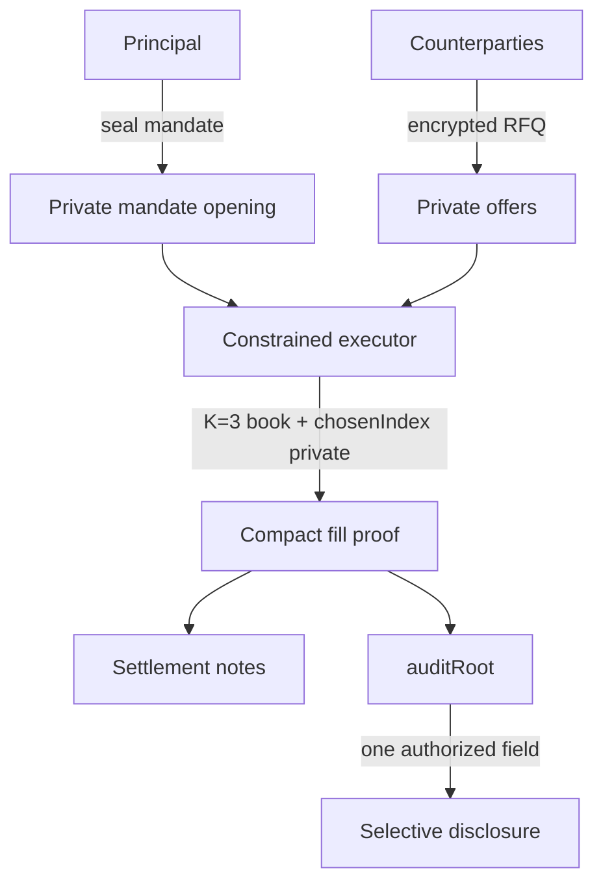
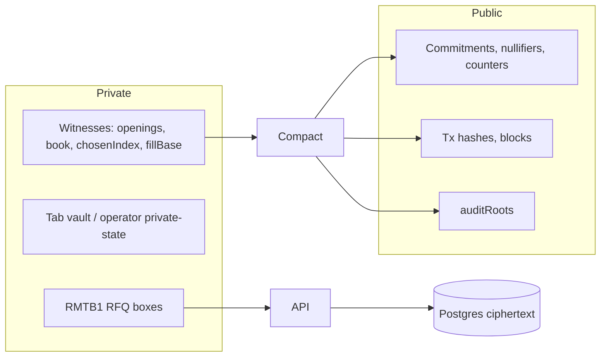
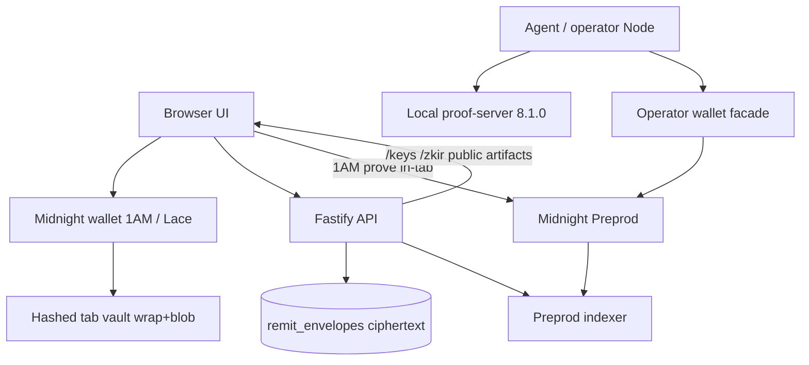
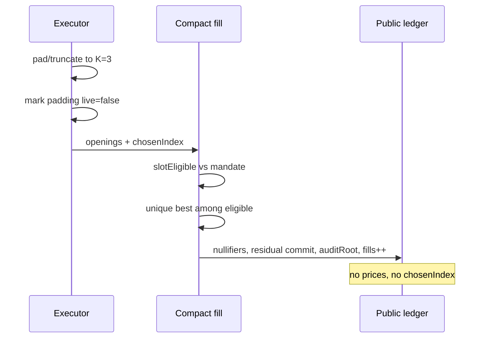
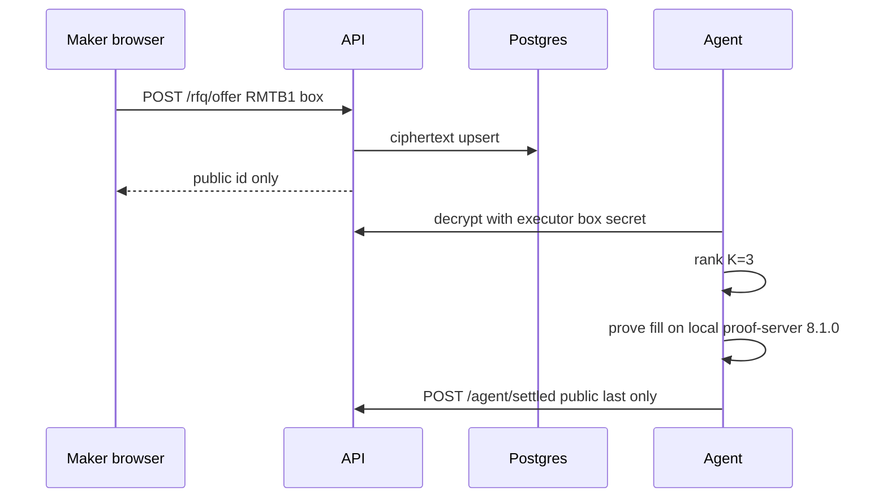
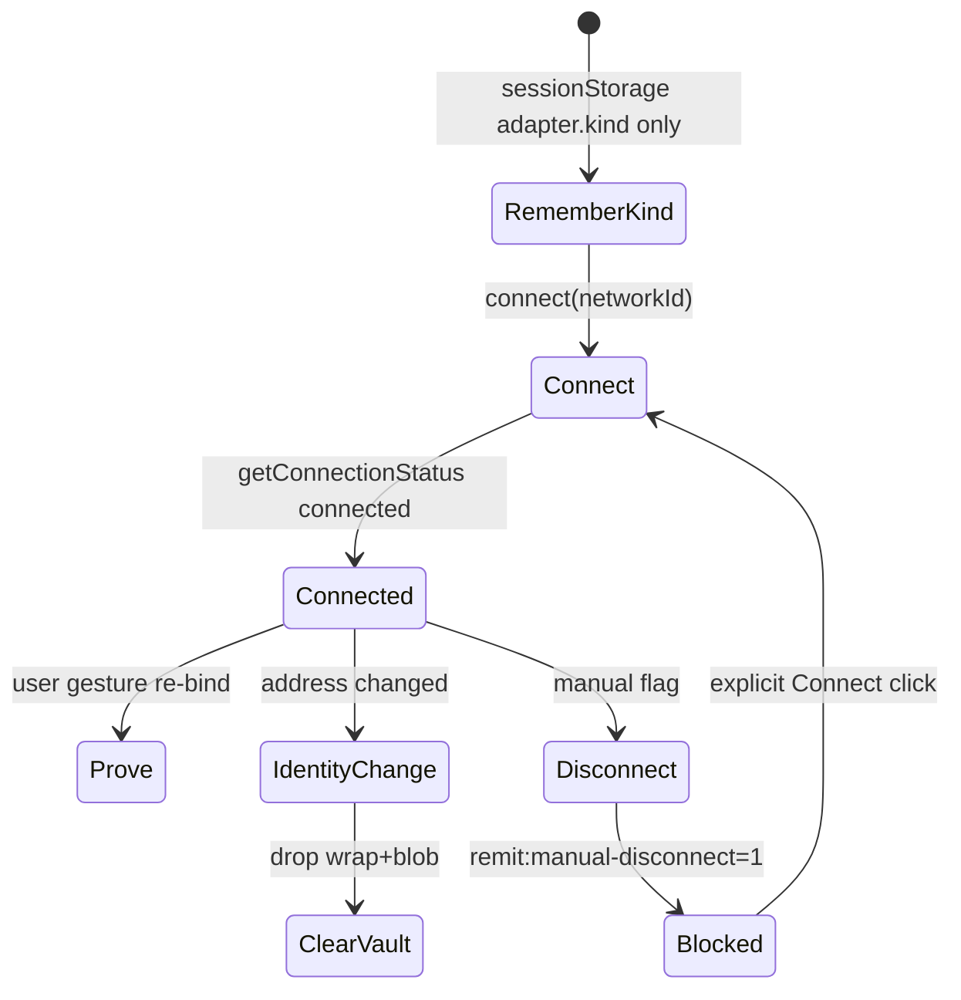
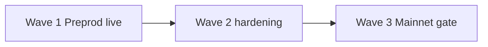

# REMIT

**A dark pool where the trader's rules are as private as the trade, and just as enforced.**

A principal seals a private mandate. Counterparties quote private liquidity. A constrained executor may choose among eligible offers. Compact proves the fill obeyed a mandate the public ledger never contained. Selective audit can later open one authorized fact without opening the book.

```
PRIVATE MANDATE
+ PRIVATE LIQUIDITY
+ CONSTRAINED EXECUTOR
+ ZK POLICY ENFORCEMENT
= VERIFIABLE EXECUTION
```

Wave 1 is live on Midnight **Preprod** (ledger 8, `protocolVersion` 1000000). Wave 2 and Wave 3, including an explicit **Mainnet** target, are in [PLAN.md](./PLAN.md). Judge-facing summary: [ABOUT.md](./ABOUT.md).

REMIT-Q is a **testnet-only** contract-minted quote token. It is **not** a stablecoin.

---

## Why REMIT exists

Delegated execution leaks strategy. A broker, an agent, or a public order book that can see limit price, size, budget, expiry, and admitted counterparties can trade against those fields. Promising that an agent "will behave" is not a proof.

REMIT is built for the case where:

- the principal must delegate,
- the market must not read the mandate,
- a fill must still be checkable.

Midnight's dual ledger is what makes that combination possible: witnesses stay private, Compact enforces the relation, the public ledger records commitments, nullifiers, counters, and an `auditRoot`.

---

## Core idea



1. Principal creates a mandate (asset, side, cap, limit, remaining budget, counterparty Merkle root, executor key, expiry).
2. Makers place offers. RFQ transport is an X25519 sealed box (`RMTB1`), not a public book.
3. The executor ranks eligible slots with Compact-identical helpers and constructs a K=3 witness.
4. Compact `fill` proves the selected live slot is the unique best eligible candidate **among those K openings**, inserts a residual offer if the fill is partial, pays out, advances mandate state, and commits `auditRoot`.
5. Anyone can verify the transaction. Nobody learns `chosenIndex`, prices, or sizes from the public ledger.
6. An auditor may later verify one authorized field against `auditRoots`.

**MBBE (Mandate-Bound Best Execution)** means exactly that K-set relation. It is **not** global-book best execution. Matching is **not** MPC. The executor is a constrained broker: it sees openings it is given.

---

## What Midnight protects

Midnight keeps a public ledger and a private witness space. REMIT uses both.



Proof generation for user circuits in-browser (1AM `getProvingProvider`) or via **local** proof-server 8.1.0 (Lace / operator Node). Official guidance: do not send witnesses to a third-party hosted prover. Render therefore keeps `httpSubmit: false`.

---

## System architecture



**Where plaintext exists**

| Location | Plaintext? |
|---|---|
| Browser tab vault after unlock | Mandate/offer openings for that wallet only, sealed at rest (`RMTPS1`) |
| Operator private-state (gitignored) | Executor openings for prove/submit |
| Compact witnesses during prove | Yes, inside the prover. Not posted as public tx fields |
| Postgres `remit_envelopes` | No. Ciphertext + owner_binding + nonce |
| `GET /health` `/evidence` `/chain` `/agent/status` | No openings, no `fillBase`, no `chosenIndex` |
| Public ledger | Commitments, nullifiers, counters, `auditRoot` |

---

## Private vs public state

| Item | Private | Public |
|---|---|---|
| Mandate opening (caps, limit, budget, counterparties, expiry) | yes | commitment + merkle membership |
| Offer opening (price, size, maker) | yes | commitment + nullifier after spend |
| `chosenIndex` | yes | never |
| `fillBase` / `fillQuote` | yes | never |
| Residual leftover size | yes | residual offer commitment only |
| Note openings / `ownerSk` | yes | note commitment / nullifier |
| `auditSeed` / field salts | yes | `auditRoot` |
| `fills`, `activeMandates`, `openOffers` | no | yes |
| Transaction hash, block, protocolVersion | no | yes |
| Executor public key | derived | `executorKey` on config |
| Executor secret | yes | never |

**Boundary:** if a JSON field would let a stranger reconstruct a mandate or a book, it does not leave the proving process.

---

## Protocol objects

| Object | Role |
|---|---|
| Note | Unshielded custody note (native tNIGHT colour 0, quote colour 1) |
| Offer | Maker quote committed into the offer tree |
| Mandate | Principal rules committed into the mandate tree |
| MandateState | Remaining budget / live flag; nullified on fill or revoke |
| Residual | New offer inserted when `fillBase` < remaining size |
| Nullifier | Spend tag; replays fail |
| AuditRoot | Binding for later one-field (Wave 1) disclosure |
| Disclosure package | Off-chain openings for authorized fields only |

---

## Compact contract

`CONTRACT/src/remit_pool.compact` - pragma language `>= 0.22 && <= 0.23`, compiled with toolchain **0.31.1**. Comment in source: **7 impure circuits, do not add an 8th.**

`CONTRACT/src/remit_quote.compact` - REMIT-Q faucet. Separate contract. No cross-contract calls.

### Impure circuits (`remit_pool`)

| Circuit | Purpose | Private inputs (witnesses) | Public / disclosed | Invariant | Failure |
|---|---|---|---|---|---|
| `deposit` | Escrow a note into the pool | spend note, owner secret, nonce, path | new note commitment | colour in {0,1} | wrong colour, bad path |
| `withdraw` | Return a leftover note to `withdrawTo` | spend note, owner secret, recipient | recipient gets unshielded funds (amount is public) | owner only | wrong owner, bad encode |
| `placeOffer` | Commit a maker offer | offer data, rand, note | offer commitment | funded | bad note, bad colour |
| `cancelOffer` | Owner cancels | offer opening, path | offer nullifier | owner | unauthorized |
| `createMandate` | Commit principal rules | mandate data, rand, funding | mandate commitment, `activeMandates++` | executor key bound | bad funding |
| `revokeMandate` | Kill authorization | mandate + state openings | revocation tag, `activeMandates--` | principal | unauthorized |
| `fill(nowBound)` | Settle one MBBE fill | K=3 book + paths, `chosenIndex`, `fillBase`, mandate state, audit seed | selected offer nullifier, state nullifier, residual commit, payout commits, next state, `auditRoot`, `fills++` | unique best eligible in K, policy, residual math | ineligible, dominated, over-cap, expiry, replay |

### Pure helpers (selected)

`ownerKey`, `executorKey`, `noteCommitment`, `noteNullifier`, `offerCommitment`, `offerNullifier`, `mandateCommitment`, `mandateStateNullifier`, `auditRootOf`, `fieldSalt`, `priceAtLeast` / `priceAtMost`, `fillableBaseOf`, `betterPrice`, `samePrice`, `residualPayNonceOf`.

Quote circuits: `quoteColor`, `claim` (daily cap 1000 units, 6 decimals).

---

## MBBE

K = 3. Witnesses: `book(): Vector<3, OfferSlot>`, `bookPaths()`, `chosenIndex(): Uint<8>` with `assert(idx < 3)`.



- **Eligibility:** colour, side, counterparty path, price vs limit, size vs cap, remaining budget, expiry vs `nowBound`.
- **Ranking:** Compact `betterPrice` / `samePrice` (and TypeScript twins in `packages/core/src/mbbe.ts` + `packages/agent`).
- **Padding:** copies with `live=false` cannot win.
- **All-ineligible:** proof fails. No settlement tx.
- **Adversarial selection:** choosing a strictly worse eligible slot must fail Compact (Wave 1 tests; Wave 2 tightens the relation further).
- **Not claimed:** best of the global book, or best of offers never placed in the witness.

---

## Custody

Unshielded notes. Asset 0 = native tNIGHT. Asset 1 = constructor quote colour (REMIT-Q on Preprod). Deposit and withdraw **amounts are public**. That is an honest unshielded boundary, not a bug to paper over.

Operator leftover withdraw on Preprod: tx `999e2b5b3a32c7537ebba3ecb9afd7bce77f8ff205f97e361c2be5e35490fce5` block **2550510**.

Chrome leftover withdraw is **not** claimed GREEN. A Chrome deposit succeeded (`cdb04c15…` block 2551700) then recipient encode failed on Bech32. The fix is in-tree; explorer-gated Chrome `withdraw()` from that tab is still YELLOW.

---

## Agent

The agent is **constrained execution infrastructure**, not a chatbot.

| | Sees | Decides | Cannot |
|---|---|---|---|
| Agent | Openings it is given (encrypted inbox) | Rank eligible K-set | Authorize settlement |
| Compact | The same openings as witnesses | Accept or reject the relation | Trust the agent |
| Public HTTP | selectedId, tx hash, counters | n/a | See openings |

`REMIT_AGENT_STRATEGY=deterministic-best-quote`. An `llm-advisor` value, if ever enabled, is advisory only and must not call `submitCircuit`.

Hosted `/agent/rank` requires an admin Bearer token and a mandate opening. Unauthenticated rank is 401. Render does not prove or submit fills.

---

## RFQ



Encryption: X25519 sealed box, `packages/core/src/box.ts`. Inbox snapshot `RMTI1`. Durable table `remit_envelopes` with RLS deny-all. Server uses the Postgres protocol. `DATABASE_URL` is never `NEXT_PUBLIC_` / `VITE_`.

---

## Privacy model

**Guarantees (Wave 1, tested):**

- Public JSON leak scans omit openings, `fillBase`, `chosenIndex`, secrets (`TESTS/privacy`).
- Tab vault keys are `SHA-256(network|pool|wallet)`, not raw Bech32.
- Circuit bundle scan for embedded secrets.
- Correlation-tag tests for reusable public identifiers.
- Forged selective-audit packages fail (`open-1` / `root`).

**Does not guarantee:**

- Traffic analysis or timing immunity (jitter exists, it is not a mixer).
- Global-book privacy of offers never sent to this executor.
- Unshielded amount privacy on deposit/withdraw.
- Hosted third-party proving (explicitly refused).

---

## Persistence

Render no longer depends on free-plan disk.

- Table `remit_envelopes`: UUID, `kind`, `owner_binding`, unique `nonce`, `ciphertext`, `meta`.
- RLS enabled; PUBLIC/anon/authenticated revoked; deny-all policies.
- Password `@` in URLs must be `%40`. TLS `ssl: "require"`.
- Restart evidence: RFQ `1789419853264-0` survived redeploy with `persist.backend=supabase`.

---

## Wallet lifecycle



1AM proves createMandate / revoke / placeOffer / withdraw in-tab. Lace uses local proof-server `http://localhost:6300`. Header DUST is **not** spendable coins. `availableCoins >= 1` is the operator dust gate.

---

## Proof architecture

| Path | Who | Prover |
|---|---|---|
| Browser 1AM | Principal / maker | Wallet `getProvingProvider` + hosted `/keys` `/zkir` |
| Browser Lace | Principal / maker | Local proof-server 8.1.0 |
| Operator fill | Executor Node | Local proof-server 8.1.0 (`fill.prover` is large; not an in-tab circuit) |

Compile: `npm run compile` (full zk, WSL Ubuntu on Windows) or `npm run compile:skip-zk` (CI / iteration).

Hosted keys: `https://remit-api-node.onrender.com/keys` (CORS `*`). `withdraw.prover` is served (9980342 B). Prover keys are gitignored; Render fetches the public tarball at build.

---

## Real Preprod evidence

Explorer (use either):

- `https://explorer.1am.xyz/tx/<hash>?network=preprod`
- `https://preprod.midnightexplorer.com/tx/<hash>`

Live contracts:

| Artifact | Address | Deploy tx | Block |
|---|---|---|---|
| Quote REMIT-Q | `7559e38693725dafef73486f2ee3aa30ee0b5b543e22d0aa5ad7303c37b55e3f` | [`04800c4c…`](https://explorer.1am.xyz/tx/04800c4ca43dd572d77ca1e5cf604702c609ff091ecb567f942ff15e17c08008?network=preprod) | 2538374 |
| Pool MBBE K=3 | `01bebd52ad1b243b390c853bbc2c1588d1cf0f487934d54d79f8a590505c105e` | [`55224e41…`](https://explorer.1am.xyz/tx/55224e41e1b68f5cc65286f19e7269b199563158806fc5ae03fe9f536c61798a?network=preprod) | 2541620 |
| Pool v1 historical | `e82dea02b2397332df0bb10e2df6d9e257c8ceba696415ed3c10f639f68d43d4` | [`f8b9b324…`](https://explorer.1am.xyz/tx/f8b9b32446234af794a6d9fe33c27cd12e0815593c8e18816caa4b549418ba2c?network=preprod) | 2538382 |

Do not treat the v1 pool as K-set evidence.

| Action | Tx | Block | Why it matters |
|---|---|---|---|
| Padded K=3 fill | [`8fac31ab…`](https://explorer.1am.xyz/tx/8fac31ab4a7b76e91f8da95d8bfd0099f0a754daa4641d571dcdd45b59b92e55?network=preprod) | 2541757 | Padding cannot win |
| 3-maker partial | [`12306cbe…`](https://explorer.1am.xyz/tx/12306cbe24823f1ac39f0a1db3ee23214cc84d44cb8014b1d2f84d67838cbd20?network=preprod) | 2542039 | Live K=3 + residual commit |
| Maker placeOffer | [`c303ec61…`](https://explorer.1am.xyz/tx/c303ec61c09d406acfbec24915dd83c0546c1e833329a3e6a2f7de53b15265b2?network=preprod) | 2548791 | Encrypted RFQ path, 0 public outputs |
| RFQ fill 50/80 | [`5a1200f5…`](https://explorer.1am.xyz/tx/5a1200f5869cb60c81f9ebcb649da45fb47c563bc245c362d36665597b16f00a?network=preprod) | 2549944 | Hosted RFQ consume |
| Residual 30 | [`5f1203cf…`](https://explorer.1am.xyz/tx/5f1203cf9cdde32192f4a2cdce275ff34529b19bbe24644f6014b1c24f12b99f?network=preprod) | 2550168 | Leftover opening consumed |
| Operator withdraw | [`999e2b5b…`](https://explorer.1am.xyz/tx/999e2b5b3a32c7537ebba3ecb9afd7bce77f8ff205f97e361c2be5e35490fce5?network=preprod) | 2550510 | Leftover custody returned |
| Chrome createMandate | [`5172ab71…`](https://explorer.1am.xyz/tx/5172ab712e2cb39e5f455dd8cec609765d6fe2225ca0b0e97412cfc436df8fa9?network=preprod) | 2551299 | In-tab 1AM, 0 public outputs |
| Chrome revokeMandate | [`8ae27d7a…`](https://explorer.1am.xyz/tx/8ae27d7a3930c284a410198234d97ad110f0668af29cf89c42091b3b51882f49?network=preprod) | 2551669 | Indexer `activeMandates` 4 to 3 |
| Chrome withdraw deposit | [`cdb04c15…`](https://explorer.1am.xyz/tx/cdb04c15462fad79bcd851ec39604bae32ef3b8f2463eb44aea7e7365c05ff2d?network=preprod) | 2551700 | Deposit only; Chrome withdraw YELLOW |

`auditRoot`: `1bbc1cc2aa2cd83de56cb8ea15ec5dfb8dd071cf2fb305980416ed726b81a694` (matches `GET /audit/head`). Chrome Auditor desk: fill amount **30** VERIFIED; forged **999** REJECTED.

Lifecycle mandate (3-maker story): [`308c7b2c…`](https://explorer.1am.xyz/tx/308c7b2c57a8ab9aeefea4a1c243f5da056e6b5f4dbd4dc234cdb84aa1010749?network=preprod) block 2541972.

Committed copy: `apps/api/preprod-evidence.json`.

---

## Acceptance matrix

| Capability | Local | Preprod | Chrome | Hosted | Evidence |
|---|---|---|---|---|---|
| Compact 7 circuits | GREEN | GREEN | n/a | keys GREEN | inspect-managed |
| K=3 MBBE | GREEN | GREEN | partial | semantics GREEN | `12306cbe…` / `5a1200f5…` |
| Private mandate | GREEN | GREEN | GREEN | persist GREEN | `5172ab71…` |
| Private offer / RFQ | GREEN | GREEN | GREEN | ciphertext GREEN | `c303ec61…` |
| Fill + residual | GREEN | GREEN | explorer GREEN | settled public | `5a1200f5…` `5f1203cf…` |
| Replay reject | GREEN | operator GREEN | n/a | n/a | Compact |
| Selective audit | GREEN | GREEN | GREEN | verify GREEN | `1bbc1cc2…` |
| Forged audit | GREEN | GREEN | GREEN | `ok:false` | `/audit/verify` |
| Revoke | GREEN | GREEN | GREEN | indexer gate | `8ae27d7a…` |
| Withdraw | GREEN | operator GREEN | YELLOW | keys GREEN | `999e2b5b…` / Chrome YELLOW |
| Wallet reconnect | GREEN | n/a | GREEN | n/a | connector status |
| Hashed vault | GREEN | n/a | GREEN | n/a | no Bech32 keys |
| Persist restart | GREEN | n/a | n/a | GREEN | supabase ok |
| httpSubmit | n/a | n/a | n/a | **false** | honest |
| Tests | GREEN | n/a | n/a | n/a | vitest |
| Secret-scan | GREEN | n/a | n/a | n/a | CI |

---

## Tests

Latest verified full run: **46 files / 189 passed**.

Layout:

- `TESTS/unit` (Compact sim, API, wallet, durable, MBBE)
- `TESTS/security` (unauthorized revoke/cancel/withdraw, policy)
- `TESTS/privacy` (leaks, correlation, bundle scan)
- `TESTS/integration` (compact-runtime lifecycle)
- `TESTS/e2e` + Playwright hosted workspace (not the judge acceptance path)

Commands:

```bash
npm test
npm run test:unit
npm run test:security
npm run test:privacy
npm run test:integration
npm run secret-scan
```

---

## Judge quick start

### Path A - read-only, no wallet

1. Open https://remit-front.vercel.app (Overview reads indexer-backed `/evidence`).
2. GET https://remit-api-node.onrender.com/health - `network=preprod`, `mpc=false`, `httpSubmit=false`, `persist.backend=supabase`.
3. GET https://remit-api-node.onrender.com/evidence - public hashes only.
4. GET https://remit-api-node.onrender.com/chain - `fills`, `activeMandates`, `protocolVersion=1000000`.
5. Click any hash in the table above.

Expected: no openings in JSON. No fake GREEN for hosted prove.

### Path B - local reproduction

```bash
npm install
npm run compile:skip-zk
npm test
npm run judge:proof
```

Full zk compile (WSL Ubuntu on Windows):

```bash
compact compile --version   # 0.31.1
npm run compile
```

Proof-server:

```bash
npm run proof:up            # docker midnightntwrk/proof-server:8.1.0 :6300
npm run proof:down
```

Do not start `midnight-local-dev` while a Preprod operator session holds `:6300` (`npm run local:up` explains the gate).

### Path C - live Preprod + Chrome

1. 1AM wallet, Midnight Preprod.
2. https://remit-front.vercel.app - Connect, Open workspace.
3. Seal a mandate. Indexer `activeMandates` must increase. Explorer `createMandate` SUCCESS, 0 public outputs.
4. Settings: Revoke in the **same tab namespace**. Indexer must decrease. Explorer `revokeMandate` SUCCESS.
5. Header DUST is not spendable. Lace needs proof-server 8.1.0 at `http://localhost:6300`.
6. Do not expect hosted `httpSubmit`. Executor fills are operator Node + local prove.

---

## Local setup

Prerequisites: Node **>= 22**, npm 10, Docker (proof-server), Compact 0.31.1 for full zk (WSL Ubuntu on Windows).

```bash
cp .env.example .env.preprod.local   # fill secrets locally; never commit
npm install
npm run compile:skip-zk
npm test
npm run typecheck
npm run secret-scan
npm run proof:up
npm run api                          # Fastify :8787
```

Frontend (separate tree `front/`):

```bash
cd front
npm install
npm run dev                          # :3000
```

Public env for the browser is generated by `npm run front:env` (only `NEXT_PUBLIC_*`).

---

## One-command judge evidence

```bash
npm run judge:proof
```

Prints LOCAL gates (managed artifacts, 7 verifiers, runtime pin, secret-scan, optional vitest), committed Preprod hashes with explorer URLs, then HOSTED probes. Uses `[GREEN]` `[YELLOW]` `[RED]`. Never prints mnemonics, `DATABASE_URL`, or box plaintext.

Skip long tests in CI after `npm test` already ran:

```bash
JUDGE_SKIP_TESTS=1 npm run judge:proof
```

---

## Security verification

```bash
npm run secret-scan
npm run runtime-tree
node scripts/inspect-managed.mjs
npm run docs:scan
npm run about:count
npm run test:security
npm run test:privacy
npm run build -w @remit/api
```

CI (`.github/workflows/ci.yml`): Compact 0.31.1 attempt, secret-scan, runtime-tree, unit/security/privacy/integration, inspect-managed, public-doc scan, API build, frontend typecheck, ABOUT character gate, `judge:proof`.

No `ownPublicKey()` authentication. No secrets in `VITE_` / `NEXT_PUBLIC_`. No fake settlement hashes in UI.

---

## Known limitations

- Hosted `httpSubmit` is **false**. Render does not run proof-server 8.1.0.
- MBBE is K=3, not global-book.
- Unshielded deposit/withdraw amounts are public.
- REMIT-Q is testnet-only, not a stablecoin, not Mainnet money.
- Chrome leftover withdraw is YELLOW (deposit `cdb04c15…` is not a withdraw proof).
- Compact 0.34 / ledger 9 is a different generation. This pool is 0.31.1 / ledger 8.
- Operator wallet restore must never genesis-replay against a warmed Preprod cache.
- 1AM header DUST is not `availableCoins`.

---

## Wave roadmap



- **Wave 1:** this repository, this Preprod pool, this evidence table.
- **Wave 2:** [PLAN.md](./PLAN.md) (best-compliant K relation, unlinkable discovery, purpose-bound audit, residuals, sandbox, persistence drills).
- **Wave 3:** real Mainnet after an experimental compatibility gate. Not a slogan.

---

## Wave 1 - what shipped

- Compact pool + quote compile on 0.31.1 (7 impure pool circuits).
- Encrypted RFQ, durable ciphertext inbox, hashed browser vaults, wallet reconnect from real connector status.
- Preprod MBBE fills including 3-maker partial and hosted RFQ 50/80 + residual 30.
- Replay of spent openings Compact-rejected.
- Selective audit VERIFIED / forged REJECTED.
- Chrome createMandate and revokeMandate indexer-gated.
- Operator withdraw SucceedEntirely.
- Tests, secret-scan, CI pin checks.
- Honest `httpSubmit: false` and honest MBBE semantics (`globalBest: false`).

Engineering failures that shaped the architecture (rewind, missing `privateStateId`, Bech32 recipient, hashed vaults, withdraw.prover hosting) are recorded in the private execution log. The public contract is the invariants above, not a diary.

---

## Wave 2 + Wave 3

Wave 2 hardens the same mechanism: stronger in-K best-compliant proofs, unlinkable discovery, multi-field purpose-bound audit, residual lifecycle, institutional templates, judge sandbox, persistence drills. Compact stays authoritative. Models never settle.

Wave 3 targets **Mainnet**. Official Midnight docs: Preprod is the last public network before production; Mainnet has no faucet and requires DUST registration. REMIT will not deploy until ledger, Compact, midnight-js, wallets, proof-server, indexer, and custody lanes are experimentally verified for that network. See [PLAN.md](./PLAN.md).

---

## Stack pin

Compact **0.31.1** / language **0.23** · midnight-js **4.1.1** · wallet-sdk **1.2.0** · connector **4.0.1** · proof-server **8.1.0** · indexer **4.3.3-hotfix** · ledger **8** · Node **>= 22**

License: Apache-2.0 (`LICENSE`).
